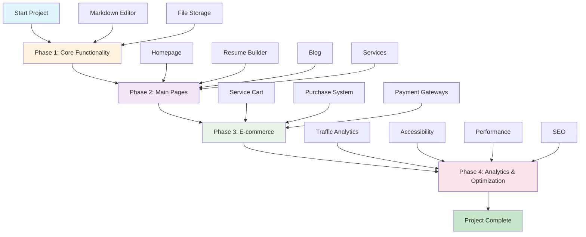

# CV Builder Project Roadmap

## Project Timeline Visualization



## Development Phases Overview

```mermaid
gantt
    title CV Builder Development Timeline
    dateFormat  YYYY-MM-DD
    section Phase 1
    Core Functionality    :p1, 21d
    Markdown Editor      :p1a, after p1, 14d
    File Storage         :p1b, after p1a, 7d
    
    section Phase 2
    Main Pages          :p2, after p1, 28d
    Homepage            :p2a, after p2, 7d
    Resume Builder      :p2b, after p2a, 14d
    Blog & Services     :p2c, after p2b, 7d
    
    section Phase 3
    E-commerce          :p3, after p2, 35d
    Service Cart        :p3a, after p3, 14d
    Purchase System     :p3b, after p3a, 14d
    Payment Gateways    :p3c, after p3b, 7d
    
    section Phase 4
    Analytics & Optimization :p4, after p3, 21d
    Traffic Statistics   :p4a, after p4, 7d
    Accessibility       :p4b, after p4a, 7d
    Performance & SEO   :p4c, after p4b, 7d
```

## Phase 1: Core Functionality
- [ ] **Online Markdown Editor**
  - Editor with live preview
  - Markdown syntax support
  - Auto-save functionality
  - Export to various formats

- [ ] **Small File Storage**
  - File upload and management
  - Support for various formats (images, documents)
  - File organization by folders
  - File search functionality

## Phase 2: Main Pages
- [ ] **Homepage**
  - Modern design
  - Project information
  - Call-to-action elements

- [ ] **Resume Builder**
  - Resume templates
  - Online constructor
  - PDF export
  - Real-time preview

- [ ] **Blog Page**
  - Article listing
  - Categories and tags
  - Content search
  - Comments system

- [ ] **Services Page**
  - Service catalog
  - Descriptions and pricing
  - Filtering and search
  - Detailed service pages

## Phase 3: E-commerce
- [ ] **Service Cart**
  - Add/remove services
  - Cost calculation
  - Promo codes and discounts
  - Cart persistence

- [ ] **Service Purchase**
  - Order processing
  - Payment method selection
  - Order confirmation
  - Purchase history

- [ ] **Payment Gateways**
  - Payment system integration
  - Secure transactions
  - Refund processing
  - Financial reporting

## Phase 4: Analytics and Optimization
- [ ] **Website Traffic Statistics**
  - Traffic analytics
  - User behavior tracking
  - Conversion tracking
  - Reports and dashboards

- [ ] **Website Optimization**
  - **Accessibility**
    - Screen reader support
    - Keyboard navigation
    - Contrast and readability
    - ARIA attributes

  - **Performance**
    - Image optimization
    - Lazy loading
    - Caching strategies
    - Resource minification

  - **SEO (Search Engine Optimization)**
    - Meta tags and headers
    - Structured data
    - Sitemap generation
    - Mobile optimization

## Technical Requirements
- Nuxt 4 + Vue 3
- TypeScript
- Tailwind CSS + Nuxt UI
- Nuxt Content for markdown
- Database (PostgreSQL/MongoDB)
- API for integrations
- Testing (Vitest)
- CI/CD pipeline

## Development Priorities
1. Core functionality (editor + file storage)
2. Homepage and resume builder
3. Blog and services
4. E-commerce features
5. Analytics and optimization

## Timeline
- **Phase 1**: 2-3 weeks
- **Phase 2**: 3-4 weeks
- **Phase 3**: 4-5 weeks
- **Phase 4**: 2-3 weeks

**Total development time**: 11-15 weeks 